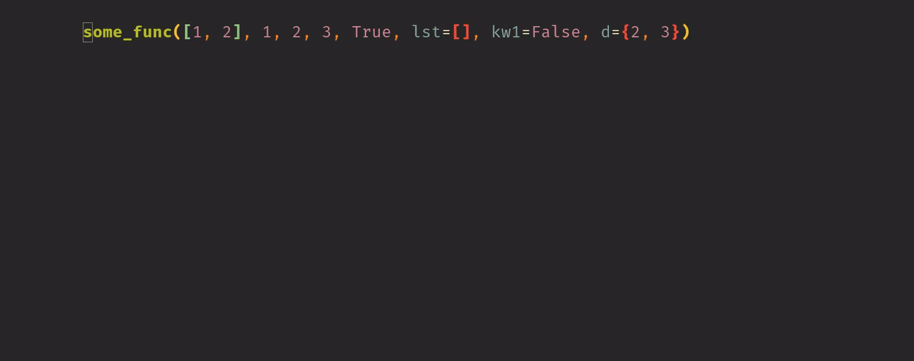

# nvim-revJ.lua

Nvim-plugin for doing the opposite of join-line (J) of arguments written in lua.
Uses [`vim-textobj-parameter`](https://github.com/sgur/vim-textobj-parameter) to determine what are start and ends of arguments.



# Installation

Use your favourite plugin manager, for example using [`packer.nvim`](https://github.com/wbthomason/packer.nvim)
```lua
use {
    'AckslD/nvim-revJ.lua',
    requires = {'kana/vim-textobj-user', 'sgur/vim-textobj-parameter'},
}
```
or [`vim-plug`](https://github.com/junegunn/vim-plug):
```vim
Plug 'kana/vim-textobj-user'
Plug 'sgur/vim-textobj-parameter'
Plug 'AckslD/nvim-revJ.lua'
```

# Usage
The plugin needs to be enabled by calling it's setup function.
```lua
require("revj").setup{}
```
By default no keybindings are enabled, see below for configuration.

# Configuration
These are the default values
```lua
require("revj").setup{
    brackets = {first = '([{<', last = ')]}>'}, -- brackets to consider surrounding arguments
    new_line_before_last_bracket = true, -- add new line between last argument and last bracket (only if no last seperator)
    add_seperator_for_last_parameter = true, -- if a seperator should be added if not present after last parameter
    enable_default_keymaps = false, -- enables default keymaps without having to set them below
    keymaps = {
        operator = '<Leader>J', -- for operator (+motion)
        line = '<Leader>j', -- for formatting current line
        visual = '<Leader>j', -- for formatting visual selection
    },
}
```

# Keybindings
Three keybindings can be enabled:
* `operator` for splitting arguments to new lines within a motion.
* `visual` for splitting arguments to new lines within a visual selection.
* `line` for splitting arguments to new lines from the first occurrence of an enabled bracket until its partner.
Default keybindings can be enabled in the setup (see above), which is equivalent to doing:
```lua
require("revj").setup{
    keymaps = {
        operator = '<Leader>J', -- for operator (+motion)
        line = '<Leader>j', -- for formatting current line
        visual = '<Leader>j', -- for formatting visual selection
    },
}
```
